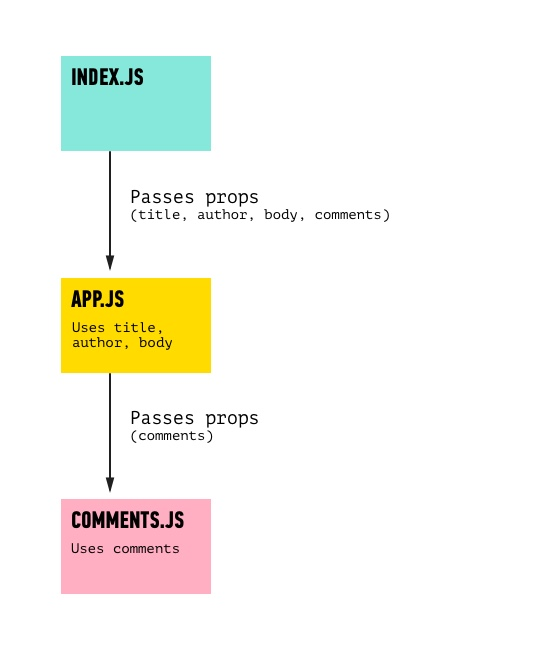

### Nested Components

##### Question:
What problems would you encounter when trying to add multiple comments to your Post?

It would be a pain to have to explicitly define every comment inside of `<Post />`, especially if each comment itself had multiple properties.
* This problem is a tell tale sign that our separation of concerns is being stretched, and it's time to break things into a new component.

We can nest Comment components within a Post component.
* We create these comments the same way we did with posts: `extends Component` and `.render`
* Then we can reference a comment using `<Comment />` inside of Post's render method.

Let's create a new file for our Comment component, `src/Comment.js`...

```js
import React, {Component} from 'react'

class Comment extends Component {
  render () {
    return (
      <div>
        <p>{this.props.body}</p>
      </div>
    )
  }
}

export default Comment
```
This looks pretty standard - we've defined our class, which we've inherited from `React Component`. We're exporting this `Comment` class by default for anything importing this file. Lastly, the JSX we're returning is a paragraph displaying a `body` prop that was passed in.

Now, in `src/App.js`, we need to import our `Comment` component so it's available. Change the top of App.js to include the new class:

```js
import React, { Component } from 'react';
// Load in Comment component
import Comment from './Comment.js'
```

Now, we'll need to render it inside of our `Post` component.
`<p>{this.props.comments[0]}</p>` is what is currently in our App.js. Now, instead of this line, we'll want to call the Comment component (which returns a paragraph with the comments, so it will do the same thing!). Edit that line to start with a call to the new component and a comment explaining it:

```js
<Comment body={this.props.comments[0]} />
```
But what just happened? We made a call to a component inside another component. Technically, we just **nested components**. Instead of calling App.js from index.js as well as Comment.js from index.js, we still are only calling App.js from index.js. Then, inside App.js, we're using some of the props and simply passing the comments prop on to Comment.js. So the flow of the props looks like this:




> **Note**: We could put all of our code in one file, but it's considered a good practice to break components out into different files to help practice separation of concerns. The only downside is we have to be extra conscious of remembering to **export / import** each component to where it's rendered.
