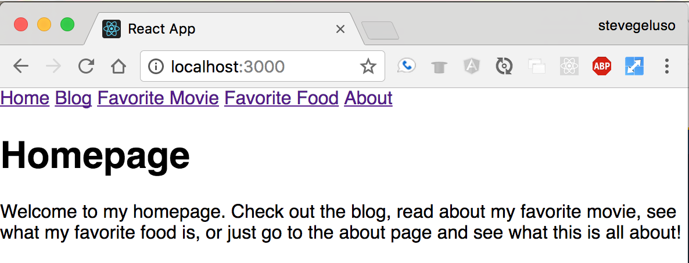

# React Router Recap

What have we learned so far?
* Single Page Applications have specific URLs that are routed to display
  different content.
* React Router is a third-party library that we can install and use with React.
* Since React Router isn't built in to React, we must import its components.
* React Router makes it easy for us to route URLs to components.
* React Router automatically manipulates modern browser history mechanics.

Now let's put that to the test!

# You Do: Implement Router #

You've been told your blog needs to have five pages:
- Homepage
- Main blog
- Favorite movie
- Favorite food
- About page

You already have the "Main blog" page! One down, four to go.

Task:

- Each page is a component - we're learning to use React Router here!
- Create a navigation menu of list items that Route to each page.
  - These pages don't need to have much content - just the header at the top saying what the page is and a paragraph description of your choosing.


> *Hint*: You'll need multiple .js files

> *Food for thought*: Do you have react-router-dom installed for this project?

> *Hint*: You can instantiate a component with `props` inside of a `<Route>` element. An example is below:


```js
<Route path="/blog" component={
    () => (<Blog title={post.title}
              author={post.author}
              body={post.body}
              comments={post.comments} />
)}/>
```


## Solution

Your solution should look something like as follows:



Here's the actual link to the solution:
