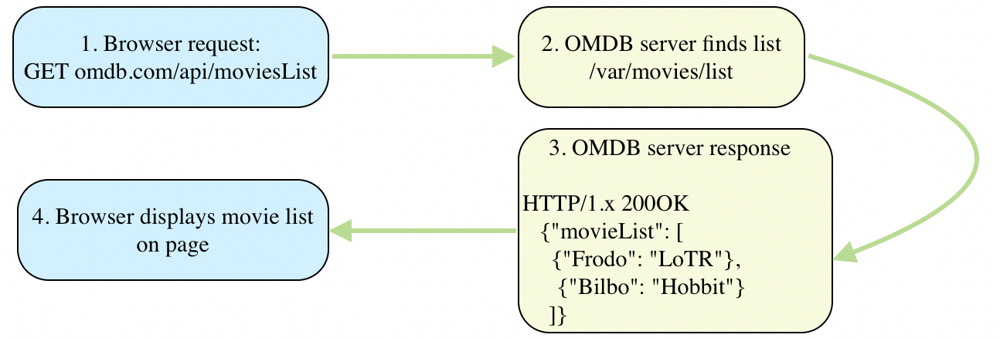

## Introducing `fetch()`

So... we know what an API is. Now what?

How can we use an API to dynamically manipulate the DOM with the given data? We can use `fetch()`. In then past, these have been called **AJAX** requests. As you'll come to learn, this allows us to build single page applications that do not require refreshes.

**AJAX**, which stands for "Asynchronous Javascript and XML," is the method through which we are able to make HTTP **requests**. The standard requests we will be making are `GET` `POST` `PUT` `PATCH` and `DELETE`.

| Type of Request | What's It Do? |
|-----------------|---------------|
| `GET`  | Read (*'give me movie names from your database'*)|
| `POST` | Create (*'here's a new movie for your database'*)|
| `PATCH` | Update (*'hey, this movie has a new title'*)) |
| `PUT` | Update (*'hey, this movie totally changed'*) |
| `DELETE` | Delete (*'that movie is so bad you should just take it out of the database'*) |

The browser packages this together using `fetch()` and sends it off to a server. The server then listens to your request and provides a **response**. It looks something like this:



When you browse to your favorite websites, your browser is making a request and the server provides a response. `fetch()` allows us to perform the same type of requests over a network. Imagine fetching weather information and rendering it on your website. Perhaps you want to create a real-life Pokedex? You can use `fetch()` to build these applications.

#### Taking a look at fetch in action

That was a lot! Let's take a look at `fetch()` in action. Imagine we want to `fetch()` a randomly generated poem from Shakespeare. Good thing that there is an API for that, right? This API provides us with the ability get a poem using the following URL:

```
http://ShakeItSpeare.com/api/poem
```

We're then provided a response that looks like the following:

```json
{
	poem: "This Is Just To Say
	I have eaten the plums that were in the icebox
	and which you were probably saving for breakfast
	Forgive me, they were delicious",
	author: "William Carlos Williams",
	markov: 2,
	lines: 7
}
```

Okay, so that isn't a poem that the API would provide (Shakespeare is quite long for an example!), but it is an example of the JSON that you will get from that endpoint.

We can fetch this JSON easily using Javascript. Let's open [JSBin](jsbin.com). Make sure to show the Javascript and Console tabs.

Put this in, then hit 'Run' in the top right corner.

_ES6 Syntax_

[Try it!](http://jsbin.com/xabavor/1/edit?js,console)
```js
let poemApi = 'http://ShakeItSpeare.com/api/poem';
fetch(poemApi)
  .then((response) => {
    return response.json()
  }).then((json) => {
    console.log('JSON from Shakeitspeare.com', json)
  }).catch((ex) => {
    console.log('An error occured while parsing!', ex)
  });
```

Let's break this API call down into a few steps.

* `let poemApi = 'http://ShakeItSpeare.com/api/poem'`:
First, we define our API URL to fetch from

* `fetch(poemApi)`: We call fetch on that API URL.

* `.then((response) => {
	return response.json()`: We take the response when the server provides it. We return the `response.json()`

* `.then((json) => {
	console.log('JSON from Shakeitspeare.com', json)`: We take that `json` and `console.log` it.

* `catch((ex)`: If an error occurs, we catch it and log it.

That's as simple as fetch is. While there are other ways to handle the response (such as `html` or `blob`), this approach makes writing requests to APIs and other network calls in Javascript easy.

> *Production Warning!* It is important to note that while this is an ES6 standard, [some browsers such as Internet Explorer](http://caniuse.com/#search=fetch) do not support it; yet Edge does. You may need a polyfill for live projects. If you need a polyfill for a production project, [Github's polyfill is very popular](https://github.com/github/fetch).
